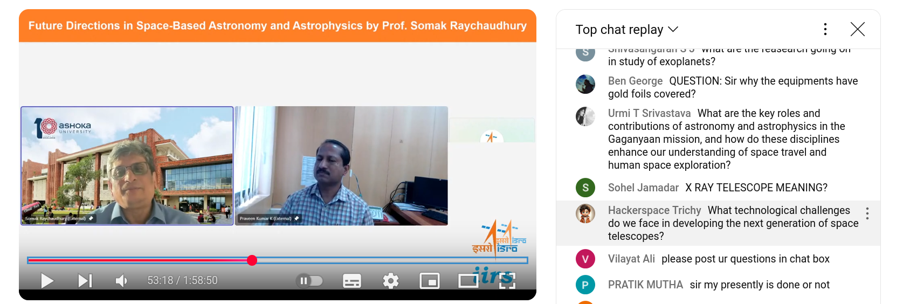
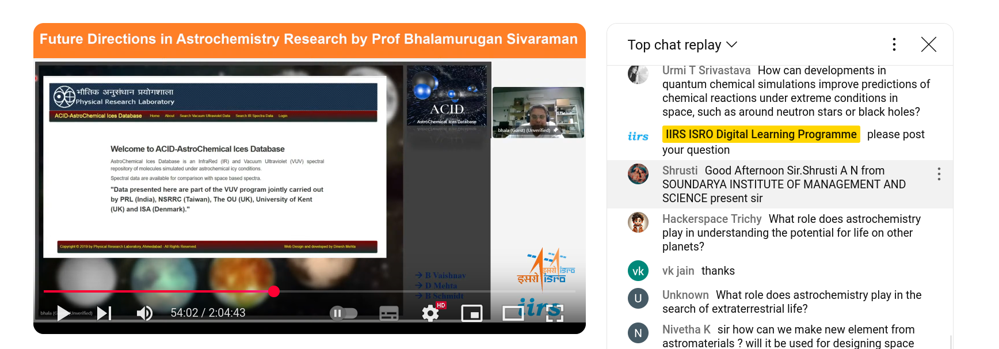
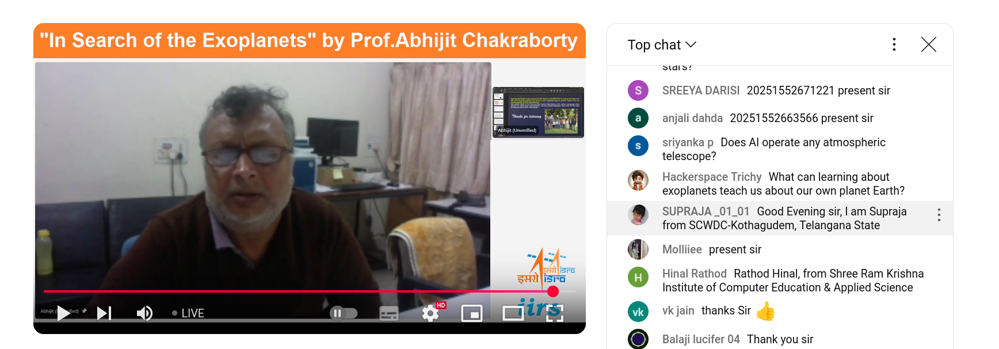
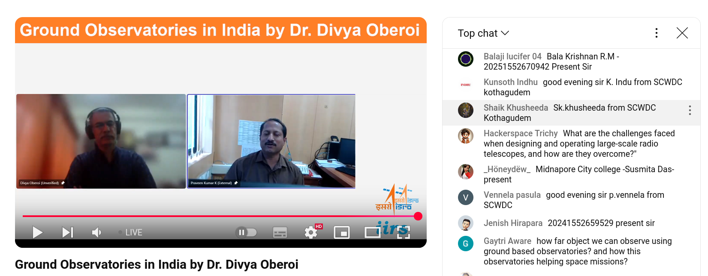
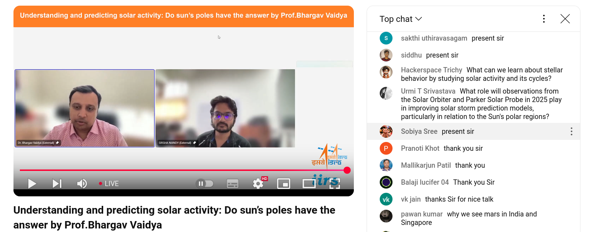
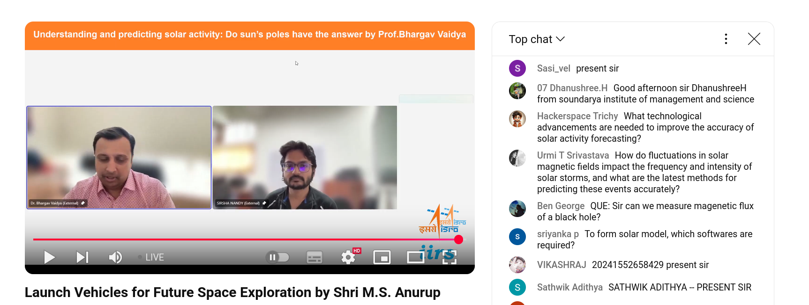
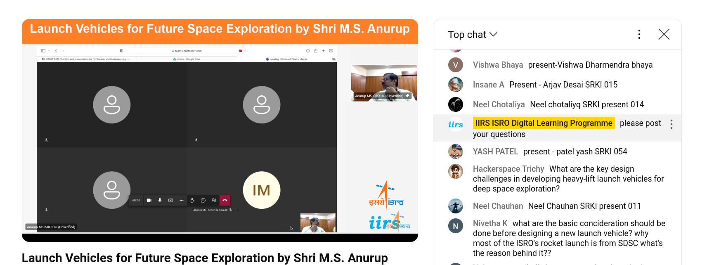

# FAQ





What technological challenges do we face in developing the next generation of space telescopes?


```
https://www.youtube.com/live/I6Jqqk6cKfg?feature=shared&t=3203
```


```
Prof. Somak Raychaudhury


Yes, so, you know, I mean, that's a very, very, very interesting question.

Of course, the most fundamental question. The, uh, the challenges are our, um, our, um, 
capability of sending very complicated payloads into space has quite a lot of restrictions.

First of all, we have a weight restriction. So, we can build a huge telescope, 
which we call the 30 m telescope, or even the Keck Telescope, that is four or five stories high. 
The diameter now—the biggest diameter—is 10 m. The 30 m telescope will have 30 m.

And so, these are huge structures, and we can build them on mountaintops. 
We can't launch them into space because, even with the biggest launch, um, you know, capabilities, 
we can probably, um, take something that is, at most, the whole thing with about 5 tons or so. 
And you can—5,000 kilograms—or it will soon become much more, but not million kilograms, 
right? So, we can't put them into space.

So, that's one of the major capabilities. 
Then is, you know, the major challenge is how to then take very complicated and very heavy instruments into space. 
And you can see that we have built, you know, other countries have built the, um, the space station. 
We will—we have our own plans of building our own space station.

They have to be taken out in pieces and assembled. 
And this is why we now have SpaceX doing this docking of different, um, uh, different parts, uh, in space. 
So, we have to figure out how to take two things up and then join them and things like that.

So, that's a big challenge of how to take complicated instruments into space and then build things there.

That's one.

The second thing is, if you have a telescope on Earth, you can go, and if something goes wrong, you can repair it. 
That capability is no longer there. I mean, with the Hubble Space Telescope, 
with the shuttle—NASA's shuttle—it was sent up with astronauts to repair the Hubble Space Telescope, and it happened many times.

But that is the only space telescope that has ever been repaired. 
I know that we are looking at building our own space station. 

We are building our own reusable shuttle technology, and with that, in the future, 
we will be able to fix things, change things in, in, in space missions. 
But we don't have that yet.

So, that's another major challenge.

And then the third major challenge is to protect our instruments and very sensitive, um, um, you know, 
computers and things like that from, um, the very hostile, um, environment in space.

There's space debris, but there's also, uh, without the atmosphere's protection, 
very hostile, um, uh, high-energy, uh, radiation and particles. And they can, uh, actually destroy a lot of the sensitive instruments that we have.

So, we have to find ways of protecting them.

So, these are some major challenges that you have, uh, in, in developing the space program that we have in India right now.

```




What role does astrochemistry play in understanding the potential for life on other planets?

```
https://www.youtube.com/live/r7U-ilzImvU?feature=shared&t=3233
```


```
restrict to this last question which I think will will be a very good way to
end the talk so the question they ask is what role does astrochemistry play in
understanding the potential for life on other planets 


Prof Bhalamurugan Sivaraman : 


Wow yes, so

Astrochemistry is very important to, like, understand the potential of life on other planets.

Because it will tell us whether the molecules of life are made or not.

If it's carbon-based life, so far we are going with the basic assumption that it's all carbon-based life everywhere.

So, astrochemistry tells us, based on the availability of ingredients, whether life would have been made there or not.

Because astrochemistry can clearly say molecules of life will be made and if they can survive whatever the planetary conditions are, 

you know, where we want to look for life.

So yes, it's very, very important.
```





What can learning about exoplanets teach us about our own planet Earth?


```
https://www.youtube.com/live/r7U-ilzImvU?feature=shared&t=7067
```


```

CH yeah, there is one question, like, uh, from Tii: How can studying exoplanets help us better understand the conditions for life beyond Earth?


Prof. Abhijit Chakraborty


Okay, uh, very interesting question. You see, so far, we have only one example, one data point, that is Earth, and we have life on it, okay.
So, just as I showed you, there is so much of a large zoo of different exoplanets, okay, but yet we have not come out with one single example of an Earth twin, 
where an Earth-like planet is going around the Sun-like star at a distance of 1 AU from the Sun with a one-year period of time, okay.

And so the idea is that the first basic question is: are we alone, okay? First is that. And secondly, how, you know, like, uh, how life has evolved on Earth. 
We still do not—I mean, we have some ideas and models—but if you see that, uh, if you look for planets around stars, let us say, 
which is somewhat in the beginning of its stage where life is getting formed, or its atmospheric conditions are not that of the current Earth, 
but at a situation where Earth was in the primal situation, like about 4 billion years ago.

So, identifying such, uh, such candidates in the future will help us to understand how, under those scenarios, 
life began to form, plus how life actually evolved.

So, when you have a large statistics, that statistics will give you how you can, uh, how, you know, like, life has evolved—actually, 
say, you know, like, um, it is like this: suppose you have a species whose whole lifetime is one day, let us say, and suppose this species, 
even though its lifetime is one day, it wants to—it is an intelligent life form—and it wants to study about human life, 
which typically, say, is 100 years. So, what it will do in one day, it cannot learn 100 years of life of a human being.

So, therefore, it will select samples from a child to an old man and then see how this is. So that is what is called statistics. 
So the statistics help us to understand, you know, how life evolved in the past on Earth and how it evolves generally in other planets, 
provided that we find such planets.

So far, we have not found such a planet, so the search is on.

```




What are the challenges faced when designing and operating large-scale radio telescopes, and how are they overcome?


```
https://www.youtube.com/live/3GLetyOON3k?feature=shared&t=3037

```


```
Yes, and uh, thank you. I think the last question will be, "What are the challenges faced when designing and operating such large-scale telescopes, and how are they overcome?" I think that's a very broad question, but I think you can just... 


Dr. Divya Oberoi :


Okay, so, uh, there are challenges on many different fronts, right? 
So, the first thing which one has to realize, which actually I did not emphasize in my talk at all, is that the signals we are talking about are extremely faint. When I mean faint, uh...

Okay, to give you an example, the unit in which we measure the strength of these signals or the energy contained in these signals is referred to as Jansky, in honor of the scientist who first discovered, you know, radio emission from outside the Earth. 

One Jansky is 10^(-26) watts per meter squared per Hertz, and that's an amazingly tiny amount of energy.
To give you a more familiar example, if you were standing on the surface of the Moon and, you know, were using your cell phone the way you would on Earth, the GMRT would be able to detect that emission. 
That's how sensitive it is.

So, one of the biggest challenges for us is to, you know, continue to operate such a fantastically sensitive telescope in the presence of all the stray radio signals which we generate during the course of our living. Right? That ranges from, you know, cell phone signals to factories which have, you know, various motors, the high power transmission lines where sparking occurs, and, you know, remote door openers for my car, microwave ovens... the list is sort of endless—LED bulbs. So dealing with those, uh, is a large part of what we do. Uh, that's one of the toughest things which we are facing right now as far as radio observation...

```


What role can Lagrange points play in the development of space debris removal or mitigation strategies for protecting satellites and spacecraft?

```
https://www.youtube.com/live/3GLetyOON3k?feature=shared&t=5793

```


```
Okay, Lagrange point, even though at present it is in the nascent stage only, but one aspect is you can have constant observation of the Earth from this point. You get a constant view of that. So, basically, the tracking becomes, uh, one of the... that is, the tracking of these space debris becomes actually more useful there, and from there itself, some mitigation aspects can be easily looked into from these Lagrange points. So that way, it will be helpful.

```




What can we learn about stellar behavior by studying solar activity and its cycles?


```
https://www.youtube.com/live/o0XEXGm3fQ8?feature=shared&t=2870

```

```
Yes, so, uh, one of the questions is that, uh, is that 
what can we learn about stellar behavior by studying solar activity and its cycles? 


Prof.Bhargav Vaidya 

Yeah, I think it's a very good question, excuse me. So, uh, many of these things, 
for example, even the aditya L1, suit payload at aditya L1 also is going to study the Sun as a star system. 

So, the Sun as a star, and even the SolX and Helios will study the Sun as a star system. 
The Sun as a star allows you to understand the Sun in totality and kind of compare with different stellar activities, 
which are essentially happening, like flaring activity and so on and so forth. 

So, understanding, uh, giving, um, so understanding the Sun as a star system will not only help you to kind of compare it with other stellar activity, but also it helps you to understand what sort of cycle do these things produce. So, the solar minima, solar maxima, similar behavior, uh, will be present also in other stars of similar classes, like the G-type stars, similar to the Sun, which is a G-class star. 


So, essentially, you can actually make a one-to-one comparison as well by studying the Sun as a star system. So, that is definitely, definitely possible when you kind of do this, and this can be done with L1. 

But as I said here, you can only get point objects or study it as a star. Uh, but here, POLS gives you more detailed information as such. Yes, thanks.


```




What technological advancements are needed to improve the accuracy of solar activity forecasting?


```

https://www.youtube.com/live/o0XEXGm3fQ8?feature=shared&t=3219

```

```
No, I think this is a very interesting and important question.

You see, when you talk about forecasting, there is one thing that is very much required: 

instant data transfer from the spacecraft to the mission center so that immediate processing of that data can happen. 

This will help any models or any kind of prediction capability models to take that data, immediately run their models, and also kind of provide output. 

So, before any activity comes and hits Earth, we have the information, um, built into this.

So, any kind of flag systems from remote sensing measurements think at aditya L1 also has certain properties of flag systems—but in general, anything which has a fast kind of downtime to get the data quickly will actually help as such. 

And in addition to that, if you have, let's say, as I mentioned, this spacecraft vigil, which is basically going into the L5, which essentially has an idea, an up-to-date idea, of what is basically happening, such kind of missions can also augment and help to get the prediction better. 

So, such kind of missions is important.


```




```
What are the key design challenges in developing heavy-lift launch vehicles for deep space exploration?
```


```
 - Propulsion Efficiency: Developing powerful and efficient engines to provide the necessary thrust for long-duration missions to deep space is a key challenge.
 - Payload Capacity: Heavy-lift vehicles need to carry large payloads, which requires advanced structural materials and efficient weight management.
 - Thermal Protection: Deep space missions expose vehicles to extreme temperatures, necessitating advanced heat shields and thermal management systems.
 - Cost: Building and maintaining heavy-lift rockets is expensive, requiring careful budgeting and funding.
 - Reliability: Ensuring the launch vehicle is reliable over long distances and durations is critical for mission success.
 - Launch and Ground Infrastructure: Developing the necessary infrastructure to support large rockets, including launchpads and fueling systems, is complex.
 - Radiation Protection: The vehicle must protect both the crew (if manned) and equipment from harmful cosmic and solar radiation.
 - Autonomous Systems: Deep space exploration often requires autonomous systems for navigation, communication, and control due to long communication delays.
 - Environmental Challenges: Deep space missions involve unpredictable conditions, including micrometeoroids and space debris.
 - Long-Term Storage and Maintenance: Vehicles need systems that can withstand long periods of storage, especially for missions that involve interplanetary travel.

```


